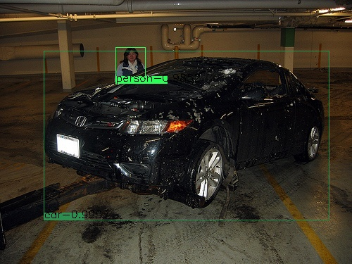
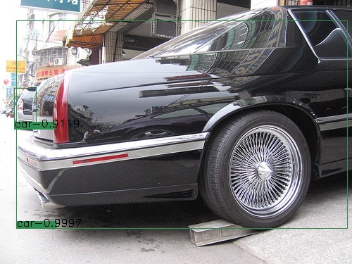

# Gaussian YOLOv3
This is an implementation of [Gaussian YOLOv3](https://arxiv.org/abs/1904.04620) on Keras and Tensorflow. The project is based on [qqwweee/keras-yolo3](https://github.com/qqwweee/keras-yolo3) and [fizyr/keras-retinanet](https://github.com/fizyr/keras-retinanet). 
Thanks for their hard work. 
The official implementation is [jwchoi384/Gaussian_YOLOv3](https://github.com/jwchoi384/Gaussian_YOLOv3)

As in the official implementation, there is a hyper parameter `sigma_const`. I get best result on Pascal VOC when set it to be 0.3.
The best result (mAP50 0.8535) is a little better than the one (mAP50 0.8500) I got by original YOLOv3. I am not sure if the improvement comes from random training or benefits from Gaussian logic.

## Test
1. I trained on Pascal VOC2012 trainval.txt + Pascal VOC2007 train.txt, and validated on Pascal VOC2007 val.txt. There are 14041 images for training and 2510 images for validation.
2. The best evaluation result (score_threshold=0.01, mAP50, image_size=416, sigma_const=0.3) on VOC2007 test is 0.8535. 
3. Pretrained official yolo weights on COCO and gaussian yolo weights on Pascal VOC are here. [baidu netdisk](https://pan.baidu.com/s/1ZgSPGt0UEWk3tDW16kbfPQ), extract code: qgnd
4. `python3 yolo/inference.py` to test your image by specifying image path and model path there. 

  
 

## Train
### build dataset (Pascal VOC, other types please refer to [fizyr/keras-retinanet](https://github.com/fizyr/keras-retinanet))
* Download VOC2007 and VOC2012, copy all image files from VOC2007 to VOC2012.
* Append VOC2007 train.txt to VOC2012 trainval.txt.
* Overwrite VOC2012 val.txt by VOC2007 val.txt.
### train
* **STEP1**: `python3 train.py --freeze-body yolo --gpu 0 --batch-size 32 --random-transform pascal datasets/VOC2012` to start training with lr=1e-3 then stop when val mAP keep dropping.
* **STEP2**: `python3 train.py --snapshot <xxx> --freeze-body darknet --gpu 0 --batch-size 32 --random-transform pascal datasets/VOC2012` to start training with lr=1e-4 then top when val mAP keep dropping.
* **STEP3**: `python3 train.py --snapshot <xxx> --freeze-body none --gpu 0 --batch-size 32 --random-transform pascal datasets/VOC2012` to start training with lr=1e-5 and then set lr=1e-6 when val mAP when dropping.
## Evaluate
* `python3 eval/common.py` to evaluate by specifying model path there.
